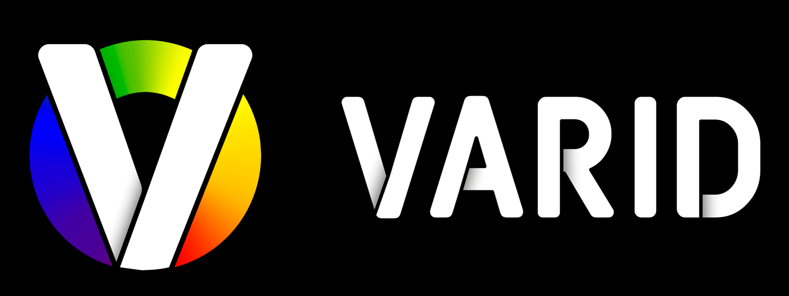

### Virtual & Augmented Reality for Inclusive Design

## Summary
- VARID is a realtime, image post processing plugin for Unreal Engine that simulates various eye conditions.
- VARID is an open, accessible tool that should continue to grow with the help of the open source community.
- VARID is supported by industry and research leaders and ultimately aims to become the ‘standard’ for simulating eye conditions.

## Demo Video
<a href="https://youtu.be/seA_JNsRZPU" target="_blank">
  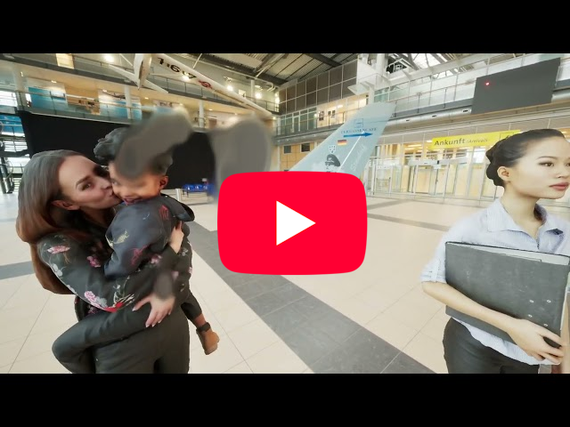
</a>

## Disclaimer
- The effects are designed to be **representative** of the conditions, based on commonly reported symptoms.
- VARID is intended to be used as a tool for design, education and research purposes. It is not intended for medical use.
- Experiencing eye conditions can be uncomfortable and disorientating. **Use at your own risk**.

## License
- [Mozilla Public License (Version 2.0)](Documentation/LICENSE.md)

## Supported Engine Version/s
- Unreal Engine 5.5
- <https://www.unrealengine.com/en-US/download>

## Installation
- Download the VARID plugin.
- Place it in your project's Plugins directory and name the folder VARID.
- Restart Unreal Engine.

### Minimal blueprint setup
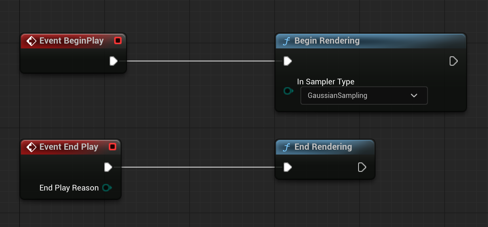

## Supported HMDs
- [OpenXR](Documentation/HMDs/OpenXR.md)
- [HTC Vive Pro Eye](Documentation/HMDs/HTC-VIVE-Pro-Eye.md)
- [Meta Quest Pro](Documentation/HMDs/Meta-Quest-Pro.md)
- [Pico 4E](Documentation/HMDs/ByteDance-Pico4E.md)
- [HP Omnicept](Documentation/HMDs/HP-Omnicept.md)

## Eye Conditions

- All conditions can address each eye individually or as a mono effect across both eyes.

**NOTE**: Screenshots below taken from demo version (Available soon)

### Cataracts
- 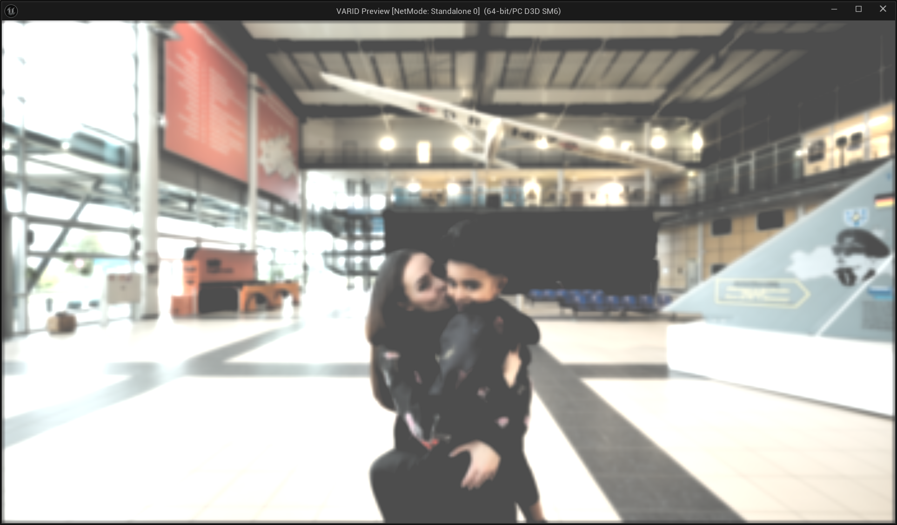
- Blurred vision
- Bloom/glare around lights
- Reduced contrast
- Parameters:
  - Eye(s)
  - Contrast Reduction
  - Blur strength
  - Glare strength
  - Brightness threshold

### Color Vision Deficiency (CVD)
- 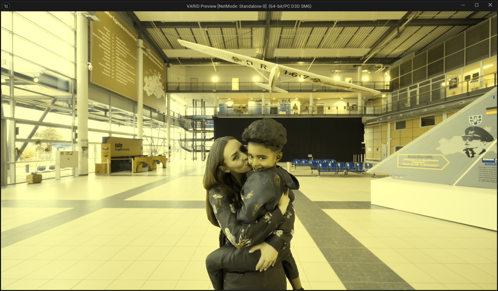
- 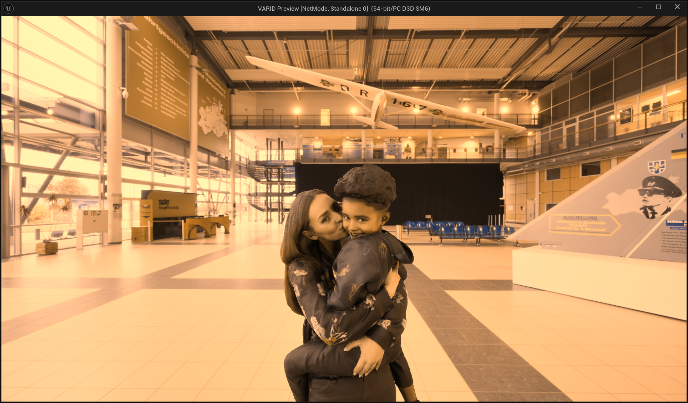
- 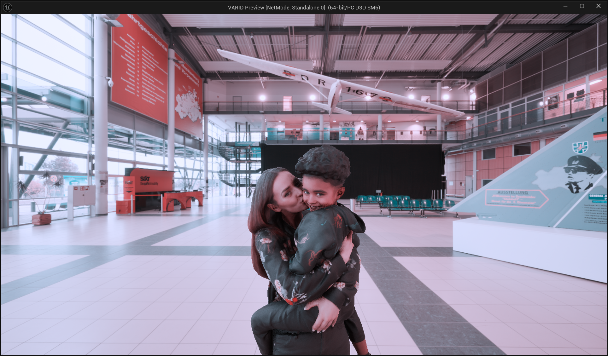
- Commonly referred to as Color Blindness
- Affects whole field of view
- Uniformly affects colors
- Applies color weight matrices, based on [Machado et al., 2009], widely used for simulations
- Types of CVD:
  - Protanopia: Red cone deficiency (can't perceive red)
  - Deuteranopia: Green cone deficiency (can't perceive green)
  - Tritanopia: Blue cone deficiency (can't perceive blue)
- Parameters:
  - Eye(s)
  - CVD Type

### Diabetic Retinopathy
- 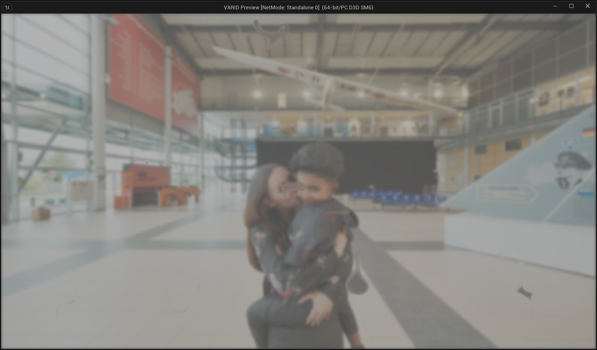
- Blurred vision
- Dark spots (floaters) scattered across the visual field
- Reduced contrast
- Parameters:
  - Eye(s)
  - Floater Textures Array:
    - Each texture can be any size. 256x256 pixels is a good starting point as floaters are generally small
    - VARID uses the Grey scale / Red channel data
    - White = Maximum Blur
    - Black = No Blur
  - Contrast Reduction
  - Number of floaters. Max 32
  - Floater textures
  - Floater speed
  - Floater size
  - Gaze position
  - Blur strength

### Glaucoma
- 
- Blurry patches (Scotomas) that can be anywhere in the visual field
- Gaze contingent
- Parameters:
  - Eye(s)
  - Gaze position
  - Scotoma texture
    - VARID uses the Grey scale / Red channel data
    - White = Maximum Blur
    - Black = No Blur

### Hyperopia
- 
- Commonly known as farsightedness
- Affects the whole field of view
- Focused = Distant objects
- Blurred = Near objects
- They are normally symmetrical across both eyes unless there's anisometropia (different refractive error in each eye)
- Parameters:
  - Eye(s)
  - Focal length
  - Blur strength

### Macular Degeneration
- 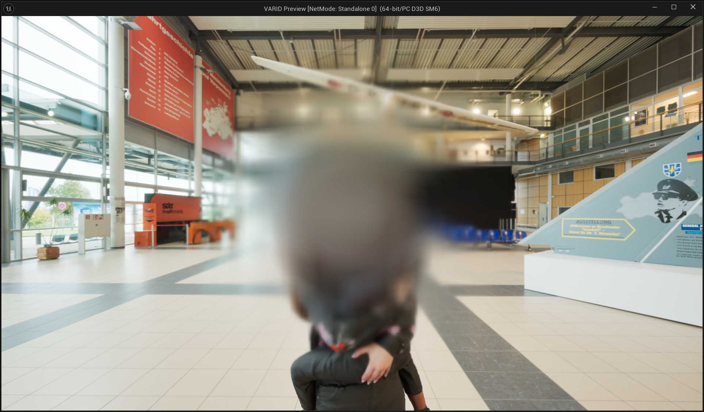
- Commonly known as Age-related Macular Degeneration (AMD)
- Central vision loss, peripheral vision remains intact
- Gaze contingent
- Parameters:
  - Eye(s)
  - Radius (NDC)
  - Blur strength
  - Gaze position

### Myopia
- 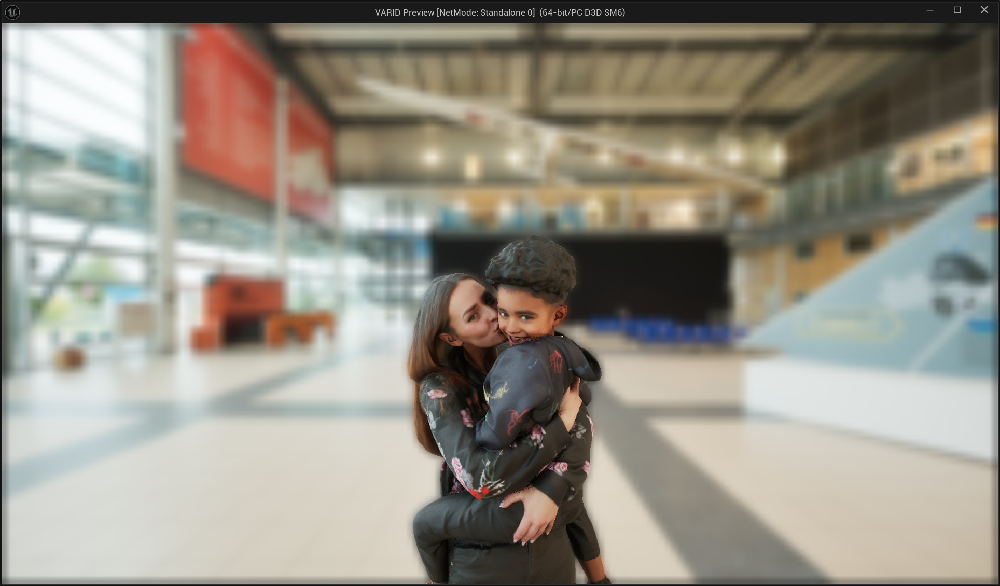
- Commonly known as nearsightedness
- Focused = Near objects
- Blurred = Distant objects
- They are normally symmetrical across both eyes unless there's anisometropia (different refractive error in each eye)
- Parameters:
  - Eye(s)
  - Focal length
  - Blur strength

### Nystagmus
- 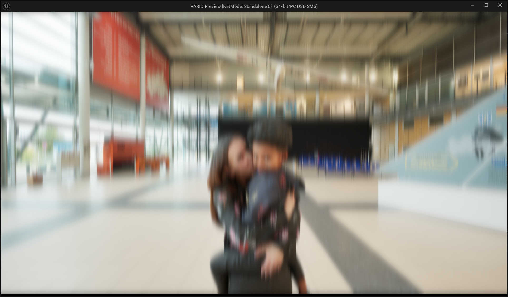
- Shaking vision
- Rhythmical, repetitive and involuntary movement of the eyes
- Whole field is unstable
- Parameters:
  - Eye(s)
  - Amplitude (X,Y)
  - Frequency (X,Y)

### Retinitis Pigmentosa
- 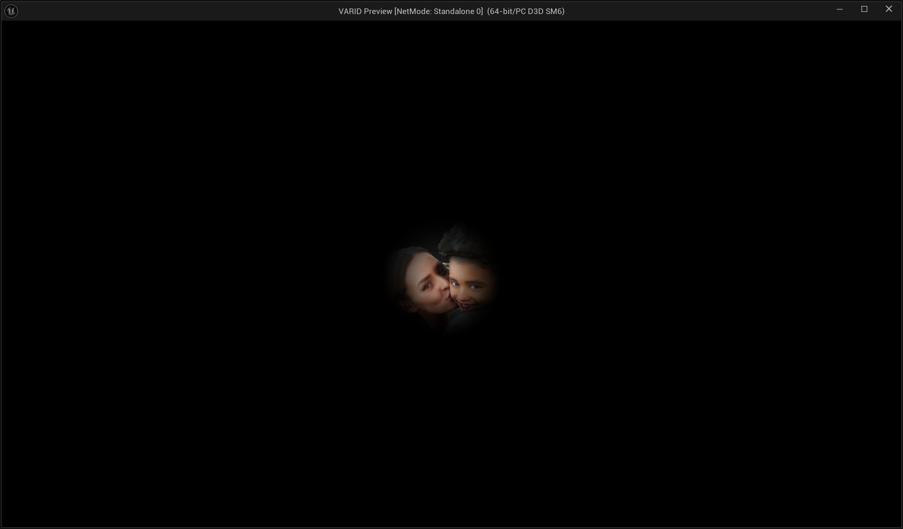
- Commonly known as Tunnel Vision
- Peripheral vision loss
- Central vision remains intact
- Gaze contingent
- Parameters:
  - Eye(s)
  - Radius (NDC)
  - Gaze position

## Eye tracking

- Typically, you will want to update VARID's gaze position on every 'Tick' using a blueprint.
- Use the VARID Blueprint function 'SetNormalizedGazePosition' that takes a Normalised value: -1...1 in both X and Y with 0,0 at the centre.

### Unreal 'Generic' Eye Tracking API
- Unreal provides a generic Eye Tracking API via a blueprint function library.
- Use the eye gaze direction data (not eye gaze origin!).
- Use the Y and Z components of the direction.
- Direction to pupil position mapping: Y -> X and Z -> Y.
- Values usually have to be attenuated by a sensitivity factor.
- Under the hood this will use a specific eye tracking API e.g. Unreal will automatically link it to the most appropriate eye tracker e.g. MetaXR, OpenXR, PicoXR, VIVE SRanipal etc.
- You may replace the generic API with more specific API as it suits.

### Use The Mouse To Test Gaze position
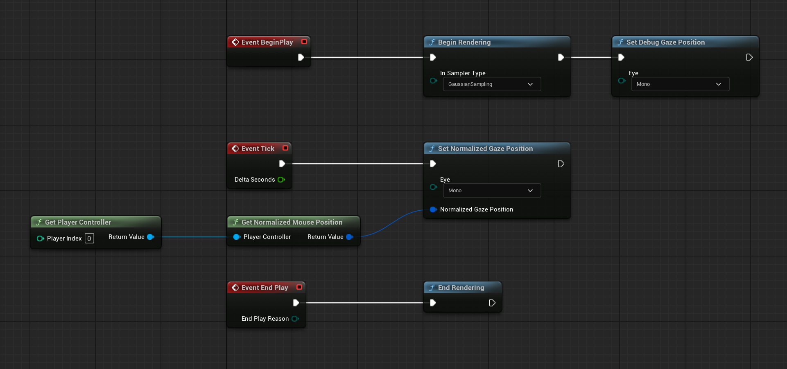

## History

### 1. OpenVisSim
- 2020
- Targets Unity3D 2017
- Developed by Dr Pete Jones
- Further development using Unity not covered by the Epic Megagrant ;)
- <https://github.com/petejonze/OpenVisSim>
- <https://www.nature.com/articles/s41746-020-0242-6>

### 2. VARID v1
- 2021
- Targets Unreal 4.27
- Funded by an Epic MegaGrant.
- Developed by Joe Bacon - Make Transition Ltd.
- Proof of concept and very much came across as too technical.
- Limited funding for development.
- technology required to do the post processing in unreal had just been released (4.26).
- It gave the raw effects to the user and expected them to construct their vision loss effect from that
- it also relied heavily on the user to understand the data driven nature of the plugin, composing eye conditions via a json files. Whilst theoretically sound, its not intuitive or practical for most users.
- <https://github.com/VARID-XR/VARID-plugin-ue4>

### 3. VARID v2
- 2025
- Targets Unreal 5.5
- Funded by an Epic MegaGrant.
- Developed by Joe Bacon - Make Transition Ltd.
- Complete rewrite addressing usability and performance, bringing the plugin up to date with modern HMD's and of course Unreal Engine.
- Eye conditions are now prominent in the design.
- New eye conditions can be added by following a much easier code template.
- Configuration now all done via Blueprints and textures, providing a much more intuitive and integrated experience.

### 4. VARID Future...?
- Contribution is welcomed and encouraged!
- [Contribute](Documentation/CONTRIBUTING.md)
- [Code of Conduct](Documentation/CODE_OF_CONDUCT.md)
- Need specific changes? Hire the original developer here: <joe@maketransition.co.uk>

## Credits
- Joe Bacon - Make Transition Ltd - Software engineering
  - <https://www.maketransition.co.uk>
- Dr Peter Jones - City St George's, University of London - Creator of OpenVisSim
  - <https://www.appliedpsychophysics.com>
- Prof Nick Tyler - UCL
  - [PEARL](https://www.ucl.ac.uk/engineering/civil-environmental-geomatic-engineering/research/groups-centres-and-sections/person-environment-activity-research-laboratory)
  - <https://profiles.ucl.ac.uk/6881-nick-tyler>
- Peter Redingus, MSc - City St George's, University of London - Optometry and Visual Science Researcher
- Adam Davis - Foster + Partners
  - [Applied R+D](https://www.fosterandpartners.com/people/teams/applied-rplusd)
- David Gillespie - Foster + Partners
  - [Applied R+D](https://www.fosterandpartners.com/people/teams/applied-rplusd)
- Epic Games
  - [Epic Megagrant Funding](https://www.unrealengine.com/en-US/megagrants)
